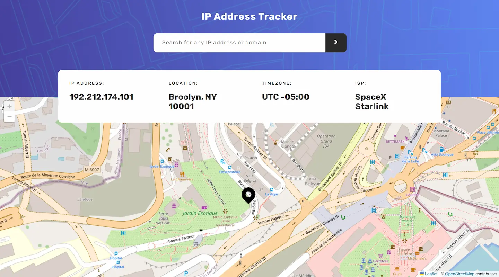

<div align="center">

# IP Address Tracker

📍A website to track and obtain information based on an IP address or a domain. This is a solution to the [IP Address Tracker challenge on Frontend Mentor](https://www.frontendmentor.io/challenges/ip-address-tracker-I8-0yYAH0). To get the IP Address info I used the [IP Geolocation API by IPify](https://geo.ipify.org/). To generate the map I used [LeafletJS](https://leafletjs.com/).

[Solution][solution-url] . [Live Page][live-page]

</div>

<details>
<summary>Table of contents</summary>

-   [Overview](#overview)
    -   [The challenge](#the-challenge)
    -   [Screenshots](#screenshots)
    -   [Links](#links)
-   [My process](#my-process)
    -   [Built with](#built-with)
    -   [What I learned](#what-i-learned)
    -   [Useful resources](#useful-resources)
-   [Author](#author)

</details>

## Overview

### The challenge

Users should be able to:

-   View the optimal layout for each page depending on their device's screen size
-   See hover states for all interactive elements on the page
-   See their own IP address on the map on the initial page load
-   Search for any IP addresses or domains and see the key information and location

### Screenshots

<table>
        <tr>
		    <td>
                
            </td>
            <td>
                
            </td>
        </tr>
</table>

### Links

-   [Solution][solution-url]
-   [Live Page][live-page]

## My process

### Built with

-   [React](https://reactjs.org/) - JS library
-   [Styled Components](https://styled-components.com/) - For styles
-   [Vitejs](https://vitejs.dev)
-   [Axios](https://axios-http.com)
-   [LeafletJS](https://leafletjs.com/) - For map generation
-   [IP Geolocation API by IPify](https://geo.ipify.org/) - To obtain the information of the IP or domain

<p align="right">(<a href="#top">back to top</a>)</p>

### What I learned

This challenge in particular was easy except for one thing: updating the map when getting the information, in the official Leaflet documentation it is made clear that the map is immutable, so I decided to investigate and found [React Leaflet](https://react-leaflet.js.org), which made it much easier for me. To update the map I used React's key.

At the end the code of the map is as follows:

```js
<MapContainer key={JSON.stringify([info.location.lat, info.location.lng])} center={[info.location.lat || 0, info.location.lng || 0]} zoom={17.5} id="map">
	<TileLayer attribution='&copy; <a href="https://www.openstreetmap.org/copyright">OpenStreetMap</a> contributors' url="https://{s}.tile.openstreetmap.org/{z}/{x}/{y}.png" />
	<Marker position={[info.location.lat || 0, info.location.lng || 0]} icon={locationIcon}></Marker>
</MapContainer>
```

<p align="right">(<a href="#top">back to top</a>)</p>

### Useful resources

-   [React Leaflet](https://react-leaflet.js.org) - Made it easy for me to use leaflet in React

<p align="right">(<a href="#top">back to top</a>)</p>

[live-page]: https://ip-trackerr.vercel.app
[solution-url]: https://www.frontendmentor.io/solutions/ip-address-tracker-solution-tHNFTFIXxt